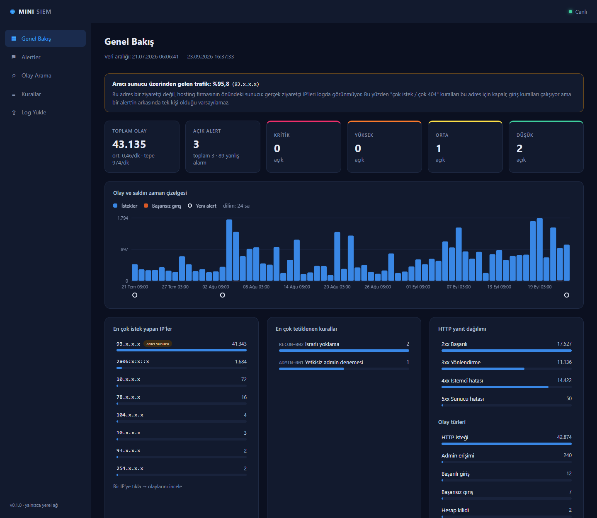
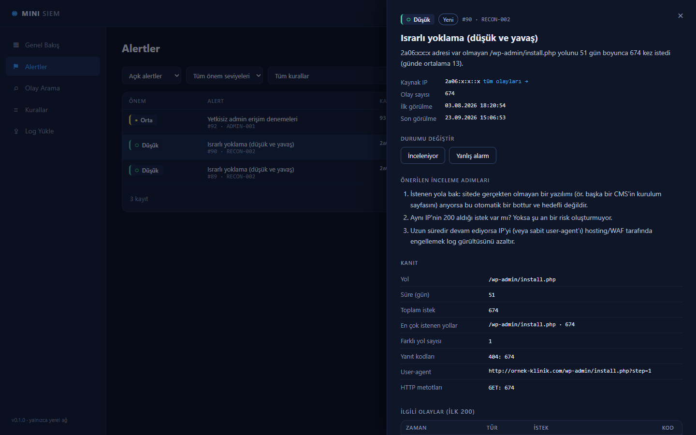
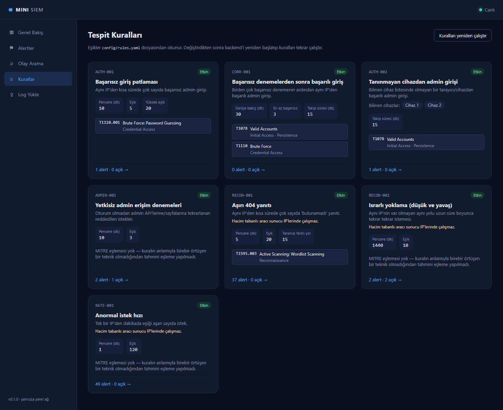

# Mini-SIEM

Gerçek bir kurumsal web sitesinin (bir ortodonti kliniği; PHP, paylaşımlı hosting) sunucu
loglarını toplayan, kişisel verileri maskeleyen, davranış tabanlı kurallarla saldırı tespit eden
ve alarmları bir SOC arayüzünde yöneten, sıfırdan geliştirdiğim eğitim amaçlı bir SIEM.

> **EN:** A small, from-scratch SIEM for a real business website: Apache log ingestion,
> KVKK/GDPR-style PII masking, 7 behavior-based detection rules plus 10 SigmaHQ signature rules
> (evaluated on the raw request before masking; 100% precision on the labeled CSIC 2010 dataset),
> MITRE ATT&CK mapping, correlation, alert triage workflow and a SOC dashboard. On 2 months of
> real logs (43,000+ events) it reduced 88 initial alerts to 3 meaningful ones.
> Python · FastAPI · React · TypeScript.



## Gerçek veride öğrendiklerim

İki aylık gerçek sunucu logu (**43.135 olay**) üzerinde çalıştırdığımda:

- **88 alarm → 3 anlamlı alarm.** Trafiğin %95,8'i tek bir IP'den geliyor gibi görünüyordu ve bu
  "tek ziyaretçi" 1.000'den fazla farklı tarayıcı kullanıyordu. Bu IP aslında hosting firmasının
  önündeki **aracı sunucuydu** (proxy): gerçek ziyaretçi IP'si logda yoktu. SIEM'e aracı sunucu
  kavramını ekledim; hacim tabanlı kurallar bu adreste çalışmıyor, giriş kuralları ise alarma
  "aracı sunucu" notu düşüyor.
- **Yavaş saldırılar kısa pencerelere takılmaz.** Bir bot 51 gün boyunca, günde ortalama 13 kez,
  sitede olmayan aynı sayfayı (`/wp-admin/install.php`) aradı. "5 dakikada 20 istek" gibi kurallar
  bunu hiç görmedi; 24 saatlik pencereli yeni bir kural (`RECON-002`) yazdım.
- **Trafiğin ~%28'i gizli dosya arayan botlardı.** `.env` (8.493 istek), `.git`, yedek dosyaları,
  hatta yapay zekâ kodlama araçlarının ayar klasörleri (`.claude`, `.mcp`). Hiçbiri başarılı olmadı.
- **Engellenmiş denemeyi alarma çevirmek gürültüdür.** İmza kuralları 319 isteği bilinen saldırı
  kalıplarıyla eşleştirdi (çoğu `.git` taraması); her eşleşme alarm olsaydı ~91 alarm çıkardı.
  Alarmı yalnızca sunucu başarılı yanıt verdiğinde üretmek bunu 2'ye indirdi; kalan 319 deneme
  kaybolmadı, olay aramasında "imza" olarak görünüyor.
- **Loglar sadece saldırıyı değil, hatayı da anlatır.** Sitedeki bir yükleme hatasının kök nedenini
  sunucu yanıtlarının bayt boyutundan buldum.



## Özellikler

| Katman | Ne yapıyor |
|---|---|
| **Log toplama** | Apache access log yükleme (düz metin veya `.gz`). Boyut sınırı, gzip bombası koruması, ikili dosya reddi, log injection'a karşı güvenli satır bölme. Aynı dosya iki kez yüklenirse çift kayıt oluşmaz |
| **Ayrıştırma** | Apache Combined/Common format, `\"` kaçışları, IPv6; tüm zamanlar UTC'ye çevrilir. Bozuk satırlar sessizce atılmaz, sayılır |
| **Normalizasyon** | Elastic Common Schema'dan (ECS) esinlenen ortak şema. Giriş API'sinin 200/401/429 yanıtlarından *başarılı giriş / başarısız giriş / hesap kilidi* olayları çıkarılır |
| **KVKK** | Kişisel veri formu olan sayfalarda tüm parametreler, hassas parametre adları (tel, email, şifre…), e-posta, telefon ve TC Kimlik No (kontrol haneli doğrulama) maskelenir |
| **Tespit** | 7 davranış kuralı + 10 SigmaHQ imza kuralı, kayan pencere mantığı, alarm tekilleştirme; eşikler YAML'da |
| **Korelasyon** | Başarısız denemelerin ardından gelen başarılı giriş **kritik** alarm olur; sonraki admin istekleri kanıta eklenir |
| **Alarm yönetimi** | Yeni → İnceleniyor → Doğrulandı / Yanlış alarm → Çözüldü. Gerekçe yazılmadan kapatılamaz, silinmeyen denetim geçmişi tutulur |
| **SOC arayüzü** | Genel bakış, alarm listesi ve detayı, önerilen inceleme adımları, olay arama (threat hunting), kural ekranı |
| **MITRE ATT&CK** | Yalnızca kuralın anlamıyla birebir örtüşen teknikler eşlenir; örtüşme yoksa eşleme yapılmaz |

### Tespit kuralları

| Kural | Davranış | Önem | MITRE |
|---|---|---|---|
| `AUTH-001` | 10 dk'da ≥5 başarısız giriş (≥20 veya kilitlenme → yüksek) | Orta/Yüksek | T1110.001 |
| `CORR-001` | ≥3 başarısız denemeden sonra aynı IP'den **başarılı** giriş | **Kritik** | T1110, T1078 |
| `AUTH-002` | Bilinen cihaz listesinde olmayan tarayıcıdan **başarılı** admin girişi | Yüksek | T1078 |
| `ADMIN-001` | 10 dk'da ≥3 reddedilen (401/403) admin isteği | Orta | — |
| `RECON-001` | 5 dk'da ≥20 adet 404; ≥15 farklı yol → tarama | Düşük/Orta | T1595.003 |
| `RECON-002` | Aynı var olmayan yola 24 saatte ≥10 istek, günlerce ("low and slow") | Düşük | — |
| `RATE-001` | Dakikada ≥120 istek | Düşük | — |
| `SIG-001` | İstek, SigmaHQ topluluk kurallarındaki bir saldırı kalıbıyla eşleşti **ve** sunucu 2xx yanıt verdi | Kuraldan | T1190 vb. |

Elastic'in 10.000 satırlık açık `apache_logs` veri setinde (baseline) imza kuralları **hiç eşleşme
vermedi**. Davranış kurallarından yalnızca `RECON-002` bir alarm üretti: bir yapılandırma aracı
(Chef) silinmiş bir dosyayı 4 gün boyunca 60 kez istemiş. Kötü niyetli değil ama "ısrarlı
yoklama" tanımına uyuyor; analist tek bakışta yanlış alarm olarak kapatır.

### İmza tabanlı tespit (SigmaHQ)

Davranış kuralları "ne kadar, ne sıklıkla" sorar; tek bir istekle yapılan saldırı (ör. SQL
injection) hiçbir eşiği aşmadan geçebilir. Bu yüzden isteğin **içeriğine** de bakılır. Kurallar
kendim uydurduğum listeler değil; güvenlik topluluğunun ortak deposu
[SigmaHQ](https://github.com/SigmaHQ/sigma)'dan değiştirilmeden alınan 10 web sunucusu kuralı
([`config/sigma/`](config/sigma/README.md), lisans: DRL 1.1). Desteklenmeyen bir kural yapısı
görülürse kural yüklenmez; sessizce yanlış çalışmaz.

- **KVKK ile uyum:** kontrol, log yüklenirken **bellekteki ham istek** üzerinde, maskelemeden
  önce yapılır (saldırgan saldırı metnini maskelenen bir alana, ör. `email=`, koyabilir).
  Veritabanına yalnızca eşleşen kuralın adı yazılır; ham istek ve saldırı metni hiçbir yerde
  saklanmaz.
- **Alarm yorgunluğuna karşı:** engellenen (3xx/4xx) denemeler alarm üretmez ama kaybolmaz:
  olaylarda imza olarak görünür, Genel Bakış'ta "engellendi" etiketiyle sayılır. Alarm yalnızca
  sunucu 2xx yanıt verdiyse (saldırı başarılı olmuş olabilir) oluşur (`alert_on: success`).
  Gerçek veride bu ayar ~91 olası alarmı 2'ye indirdi.
- **MITRE:** SigmaHQ'nun SSTI kuralındaki `T1221` (Office belgelerine şablon enjeksiyonu) web
  sunucusuna uymadığı için `T1190` olarak düzeltildi.

**Ölçüm: CSIC 2010 etiketli veri seti** (36.000 normal, 25.065 saldırı isteği):

| | Yakalama (recall) | Kesinlik (precision) | Yanlış alarm oranı |
|---|---|---|---|
| GET istekleri (access log'da görünen) | %4,2 | **%100** | **%0** (28.000 normal istekte 0) |
| Tümü (POST gövdesi dahil) | %2,5 | %100 | %0 |

Yakalama oranı düşük; nedeni ölçüldü:
- Access log POST gövdesini **hiç kaydetmez**; gövdedeki saldırıları hiçbir log tabanlı kural göremez.
- Kaçan GET saldırılarının **%82'si hiçbir özel karakter içermiyor** (geçersiz/çok uzun değer,
  parametre kurcalama). Bunlar SQL injection/XSS değil; imzalar bunun için yazılmaz, bir
  anomali (beklenen değerden sapma) modeli gerekir.
- SigmaHQ kuralları bilerek dar tutulur: **hiç yanlış alarm vermemek**, bir SOC'de her alarmın
  bir analistin zamanı olduğu düşünülünce bilinçli bir tercih.

```powershell
cd backend
.venv\Scripts\python.exe -m app.tools.evaluate_signatures ..\sample_logs\datasets\csic2010  # ölçüm
.venv\Scripts\python.exe -m app.tools.rescan_signatures <log dosyası> --deneme              # eski logları tara
```



## Kurulum ve çalıştırma

Gereksinimler: Python 3.12, Node.js 20+

```powershell
cd backend
py -3.12 -m venv .venv
.venv\Scripts\python.exe -m pip install -r requirements-dev.txt
.venv\Scripts\python.exe -m uvicorn app.main:app --reload   # API: http://127.0.0.1:8000/docs

cd ..\frontend
npm install
npm run dev                                                 # Arayüz: http://127.0.0.1:5173
```

Windows'ta `baslat.bat` ikisini birden başlatır.

### Kendi siten için ayarlar

Siteye özel bilgiler (admin sayfaları, giriş API'si, bilinen cihazlar, aracı sunucu IP'leri)
koddan ayrıdır ve **git'e girmez**, çünkü bu bilgiler saldırgana harita olur:

| Dosya | İçerik |
|---|---|
| `config/site_profile.example.yaml` → `config/site_profile.local.yaml` | Admin sayfaları, giriş API'si, kişisel veri içeren sayfalar |
| `config/rules.yaml` + `config/rules.local.yaml` | Kural eşikleri + bilinen cihazlar ve aracı sunucu IP'leri |

`.local.yaml` dosyası yoksa örnek profil kullanılır.

## Test ve kalite

```powershell
cd backend
.venv\Scripts\python.exe -m pytest        # 132 test
.venv\Scripts\python.exe -m ruff check .  # lint + bandit güvenlik kuralları

cd ..\frontend
npm run build                             # TypeScript tip kontrolü + derleme
npm run lint
```

Testler gerçek veritabanına ve yerel ayarlara dokunmaz. Test verilerinde yalnızca RFC 5737
dokümantasyon IP'leri ve açıkça sahte kişisel veriler bulunur.

## Güvenlik notları

- Sunucular yalnızca `127.0.0.1` üzerinde çalışır. **Kimlik doğrulama yoktur**, internete açılmamalıdır.
- Log verisi saldırgan verisidir: arayüzde her zaman düz metin olarak gösterilir (log üzerinden XSS'e karşı).
- Tüm veritabanı sorguları parametrelidir; YAML dosyaları `safe_load` ile okunur.
- Gerçek loglar, veritabanı ve siteye özel ayarlar repoda yoktur. Ekran görüntülerindeki IP'ler maskelidir.

## Mimari

```
Apache access log  →  Ayrıştırma  →  KVKK maskeleme  →  SQLite
                                                          │
   SOC arayüzü  ←  Alarm yönetimi  ←  Tespit motoru  ←────┘
```

| Klasör | İçerik |
|---|---|
| `backend/app/ingestion` | Güvenli dosya okuma, işlem hattı |
| `backend/app/parsers` | Apache log parser'ı |
| `backend/app/privacy` | KVKK maskeleme |
| `backend/app/normalization` | Ortak olay şeması, olay sınıflandırma |
| `backend/app/detection` | Tespit motoru ve kurallar |
| `backend/app/alerts` | Alarm durum makinesi |
| `backend/app/api/v1` | REST API |
| `frontend/src` | React + TypeScript SOC arayüzü |
| `config/` | Kural eşikleri, örnek site profili |
| `docs/` | [Mimari ve tasarım kararları](docs/architecture.md) |

**Teknolojiler:** Python · FastAPI · SQLAlchemy · SQLite · Pydantic · Pytest · Ruff ·
React · TypeScript · Vite

## Sonraki adımlar

- Anomali tabanlı tespit: imzaların kaçırdığı parametre kurcalama için "beklenen değer" modeli
- IP'nin ülkesini çevrimdışı veritabanıyla gösterme (IP'ler dışarı gönderilmeden)
- Kullanıcı girişi ve rol tabanlı yetki (RBAC), veri saklama süresi (retention)
- Yalnızca maskelenmiş alarm özetleriyle çalışan bir yapay zekâ inceleme asistanı

---

Geliştiren: **Emir Berat Türk** · [LinkedIn](https://www.linkedin.com/in/emirberatturk/)
· Geliştirme sürecinde yapay zekâ kodlama asistanı (Claude Code) kullanıldı.
